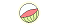

# SlotModuleMk2

# パチスロ作るやつです
maskとsoundはしくじると怖いんで枝斬ります  
https://pekko1215.github.io/slotmodulemk2/  
演出ついてそれっぽくなってきたかな  

# 基本スペック
- 規定   : ４号機  
- Type   : B+CT
- CT性能 : 201枚以上獲得または150G消化またはBIG入賞
- CT制御 : 左リールが無制御

# 配当表

| 組み合わせ |  通常  | BIG | REG,JAC
| ---- | ---- | ---- | ---- |
|    |  リプレイ   | JACIN+3枚(8G消化or8回) | JAC 13枚
|  | 10枚 | 5枚 | |
|  | 15枚 | | |
|  | 3枚 | |  |
|  | 15枚+BIG(ボーナスゲーム30GorJACIN1回) | |  |
|  | 15枚+BIG(ボーナスゲーム30GorJACIN1回) | |  |
|  | BIG(ボーナスゲーム8GorJACIN1回) | |  |
|  | BIG(ボーナスゲーム8GorJACIN1回) | |  |
| | BIG(ボーナスゲーム8GorJACIN1回) | |  |
| | BIG(ボーナスゲーム8GorJACIN1回) | |  |
| | BIG(ボーナスゲーム8GorJACIN1回) | |  |
| | BIG(ボーナスゲーム8GorJACIN1回) | |  |
| | BIG(ボーナスゲーム8GorJACIN1回) | |  |
| | BIG(ボーナスゲーム8GorJACIN1回) | |  |
| | BIG(ボーナスゲーム8GorJACIN1回) | |  |
|  | BIG(ボーナスゲーム8GorJACIN1回) | 10枚 |  |
|  | REG(8G消化or8回) | |  |
|  | REG(8G消化or8回) | |  |
|  | REG(8G消化or8回) | |  |
|    |     |  | JAC 13枚
|    |     |  | JAC 13枚

# ゲームフロー
### 通常時
通常時はBAR揃い、払い出しのない左リール枠内チェリー、ベルベルリプからBIGを目指そう！  
ボーナス後、約1/3でCTに突入だ！  
中段チェリーはCT突入確定！？  
  

### CT時
左リール枠内に赤7を目安にベルを狙おう。中右は制御でベルをひきこむぞ！  
右の3つのランプがそれぞれ上からスイカ、ベル、チェリーに対応していて、光ってる子役は取ってもCTはパンクしないぞ！  
レバーオンと同時にリールが赤く染まるとBIGのチャンス！この時、かならず、逆押しで7を狙おう!  
そろうとCTBIG確定だ！ 
  
CT中はREGも成立することがある。順押しなら取りこぼすことはないが、逆押しだとこぼす可能性がある。  
REG成立時に逆押しすると、バックライトが赤く染まるので、その時は左リールに赤7を狙いこぼさないようにしよう。
CT中逆押しすると、右リール中段にBARを引き込む制御になるので、枚数調節は逆押しがおすすめ。

### BIG中
通常時に成立したBIGはフリー押しでOK  
CTの告知方法は３種類から選べるぞ！  
  
- 緑ランプ
レバーオン時にけたたましい音とともに告知！音量注意！
- 黄ランプ
リールが第三消灯まで行けばCT確定だ！最終Gが熱いぞ！
- 赤ランプ
ボーナス中の告知はなし。ボーナス後の一発告知！
  
7揃いからスタートしたBIGはリプレイ外しが有効だ！
やり方は自分で探してみよう！